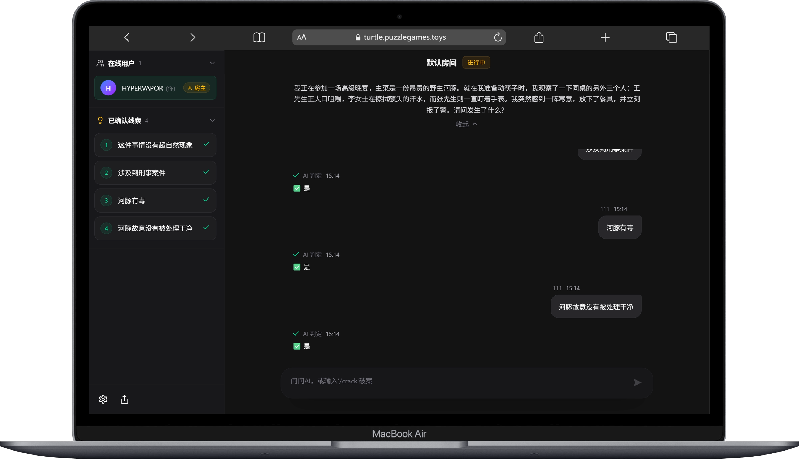
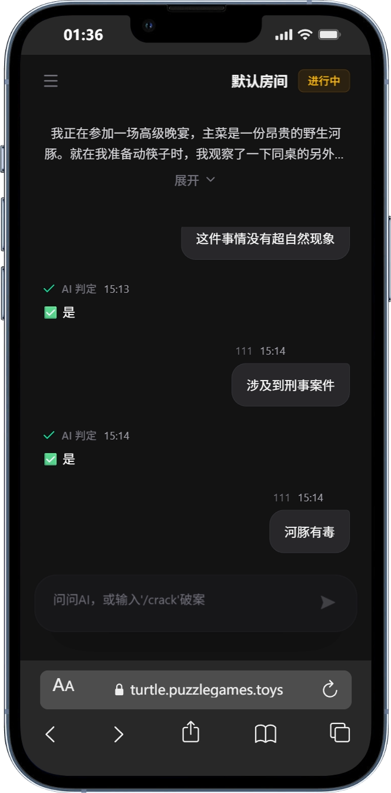
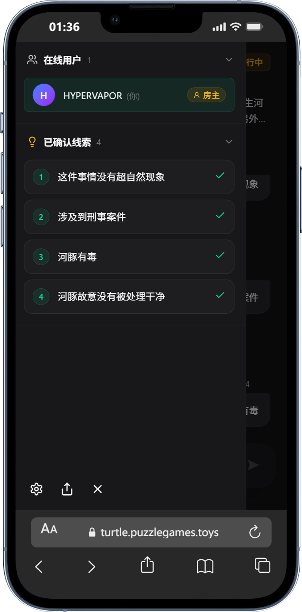

<div align="center">

# 🐢 Turtle Soup - Multiplayer Deduction Game

A modern online multiplayer Turtle Soup (情境推理) game built with Next.js 16, featuring real-time gameplay and AI-powered puzzle generation.

[](https://nextjs.org/)
[](https://react.dev/)
[](https://www.typescriptlang.org/)
[](https://tailwindcss.com/)
[](LICENSE)


</div>

## 📖 Table of Contents

- [✨ Features](#-features)
- [🎮 Screenshots](#-screenshots)
- [🚀 Quick Start](#-quick-start)
- [🎯 How to Play](#-how-to-play)
- [🏗️ Tech Stack](#️-tech-stack)
- [📁 Project Structure](#-project-structure)
- [🔐 Security Features](#-security-features)
- [📝 API Endpoints](#-api-endpoints)
- [🚀 Deployment](#-deployment)
- [🤝 Contributing](#-contributing)
- [📄 License](#-license)

## ✨ Features

- 🎮 **Multiplayer Real-time** - Support multiple players with simultaneous gameplay
- 🤖 **AI-Powered** - Integrated OpenRouter API for intelligent question judging and puzzle generation
- 💬 **Real-time Chat** - SSE-based communication with Telegram-inspired chat interface
- 🎨 **Modern Dark Theme** - Beautiful dark mode UI design
- 🔒 **Secure & Reliable** - Input validation, injection protection, JWT authentication
- 📝 **Session Management** - ChatGPT-like session management and conversation history
- 🎯 **Smart Detection** - AI automatically determines when players have solved the puzzle
- 📱 **Responsive Design** - Optimized for both desktop and mobile devices

## 🎮 Screenshots

### Desktop View


### Mobile View
<table>
  <tr>
    <td></td>
    <td></td>
  </tr>
</table>

## 🚀 Quick Start

### Prerequisites

- Node.js 18+
- npm or yarn package manager

### 1. Installation

```bash
# Clone the repository
git clone https://github.com/yourusername/puzzle-games.git
cd puzzle-games

# Install dependencies
npm install
```

### 2. Environment Configuration

Create a `.env.local` file in the root directory:

```bash
# Game Access Passcode (default: letmein)
GAME_PASSCODE=letmein

# Administrator Passcode
ADMIN_PASSCODE=admin123

# OpenRouter API Configuration
OPENROUTER_API_KEY=sk-or-v1-your-key-here
OPENROUTER_JUDGE_MODEL=openai/gpt-4o-mini
OPENROUTER_GENERATE_MODEL=anthropic/claude-3.5-sonnet

# JWT Secret (generate a secure random string)
JWT_SECRET=change-this-to-a-secure-random-string

# Data Storage Path
DATA_PATH=./data
```

### 3. Development Server

```bash
npm run dev
```

Open [http://localhost:3000](http://localhost:3000) in your browser.

### 4. Production Build

```bash
# Build for production
npm run build

# Start production server
npm start
```

## 🎯 How to Play

### Player Mode

1. Enter your username and passcode on the home page
2. Join a game room and read the puzzle scenario (汤面)
3. Ask yes/no questions to deduce the story
4. AI responds with "Yes", "No", or "Irrelevant"
5. All "Yes" answers are displayed in the "Public Information" section
6. When enough details are discovered, AI determines the game is won and reveals the answer

### Admin Features

Access `/admin` to enter the admin panel:

- **Manual Puzzle Creation** - Create puzzles by entering scenario and answer
- **AI-Powered Generation** - Let AI automatically generate interesting Turtle Soup puzzles

## 🏗️ Tech Stack

| Category | Technology |
|----------|------------|
| **Framework** | [Next.js 16](https://nextjs.org/) (App Router) |
| **UI Library** | [React 19](https://react.dev/) |
| **Styling** | [Tailwind CSS v4](https://tailwindcss.com/) |
| **Language** | [TypeScript 5.x](https://www.typescriptlang.org/) |
| **Real-time Communication** | Server-Sent Events (SSE) |
| **Authentication** | [jose](https://github.com/panva/jose) (JWT) |
| **AI Integration** | [OpenRouter API](https://openrouter.ai/) |
| **Storage** | JSON File System |
| **Icons** | [Lucide React](https://lucide.dev/) |
| **Animations** | [Framer Motion](https://www.framer.com/motion/) |
| **Validation** | [Zod](https://zod.dev/) |

## 📁 Project Structure

```
puzzle-games/
├── app/                          # Next.js App Router
│   ├── api/                      # API Routes
│   │   ├── auth/                 # Authentication endpoints
│   │   ├── game/                 # Game API endpoints
│   │   ├── admin/                # Admin API endpoints
│   │   └── sessions/             # Session management
│   ├── game/                     # Game pages
│   ├── admin/                    # Admin pages
│   └── page.tsx                  # Login page
├── components/                   # React Components
│   ├── game/                     # Game-specific components
│   ├── admin/                    # Admin components
│   └── ui/                       # Reusable UI components
├── lib/                          # Core Logic
│   ├── game/                     # Game management
│   ├── storage/                  # Data persistence
│   ├── validation/               # Input validation schemas
│   └── types.ts                  # TypeScript type definitions
├── data/                         # Data storage directory
└── assets/                       # Static assets
    ├── banner.png
    └── screenshots/
```

## 🔐 Security Features

- ✅ HTML escaping to prevent XSS attacks
- ✅ Input length limits
- ✅ Username format validation
- ✅ JWT token authentication
- ✅ Rate limiting to prevent abuse
- ✅ Security response headers
- ✅ Injection attack prevention

## 📝 API Endpoints

### Authentication
- `POST /api/auth/login` - User login and token generation

### Game
- `POST /api/game/join` - Join a game session
- `POST /api/game/message` - Send game messages
- `POST /api/game/leave` - Leave current game
- `GET /api/game/events` - SSE event stream for real-time updates

### Admin
- `POST /api/admin/create-puzzle` - Manually create a puzzle
- `POST /api/admin/generate-puzzle` - AI-powered puzzle generation

### Sessions
- `GET /api/sessions` - List all game sessions
- `POST /api/sessions` - Create a new session
- `GET /api/sessions/[id]` - Get session details

## 🚀 Deployment

### Vercel Deployment (Recommended)

1. Fork this repository
2. Import project in [Vercel](https://vercel.com)
3. Configure environment variables
4. Deploy!

### Other Platforms

Ensure the platform supports:
- Node.js 18+ runtime
- File system write permissions
- Environment variable configuration
- Server-Sent Events (SSE) support

### Environment Variables for Production

```bash
GAME_PASSCODE=your-secure-passcode
ADMIN_PASSCODE=your-admin-passcode
OPENROUTER_API_KEY=sk-or-v1-your-key
OPENROUTER_JUDGE_MODEL=openai/gpt-4o-mini
OPENROUTER_GENERATE_MODEL=anthropic/claude-3.5-sonnet
JWT_SECRET=your-jwt-secret-min-32-chars
DATA_PATH=/var/data
```

## 🤝 Contributing

Contributions are welcome! Please feel free to submit a Pull Request.

1. Fork the repository
2. Create your feature branch (`git checkout -b feature/AmazingFeature`)
3. Commit your changes (`git commit -m 'Add some AmazingFeature'`)
4. Push to the branch (`git push origin feature/AmazingFeature`)
5. Open a Pull Request

## 📄 License

This project is licensed under the MIT License - see the [LICENSE](LICENSE) file for details.

## 🙏 Acknowledgments

- Built with [Next.js](https://nextjs.org/)
- AI powered by [OpenRouter](https://openrouter.ai/)
- Inspired by the classic Turtle Soup deduction game

---

<div align="center">

## 👤 Author

**HYPERVAPOR**

## 📞 Contact

- 📧 **Email:** [me@hypervapor.org](mailto:me@hypervapor.org)
- 💼 **LinkedIn:** [Zhening Liu](https://linkedin.com/in/zhening-liu-0a2b79364)
- 🌐 **Website:** [hypervapor.org](https://hypervapor.org)
- 💻 **GitHub:** [HYPERVAPOR](https://github.com/HYPERVAPOR)

**🎉 Enjoy the game!**

</div>
